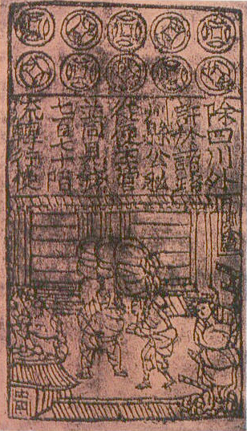

## Credit means many things.  In the context of money, it means whether someone who has borrowed money will pay back as promised and on time.  

Global debt, as of 3Q2018, is close to $244 trillion.  Yes, you read it right.

Our national debt, as of January, 2019, is $22 trillion, a 10% increase comparing with two years ago.  Please see our blog post [debt | 债务](https://www.magicmathmandarin.org/debt-债务/), and [Math of our national debt|国债数学](https://www.magicmathmandarin.org/math-for-our-national-debt/)

The credit market is extremely important to the global economy.

We will use Python and a series of Jupyter Notebooks to explore various public data including [Department of Treasury](https://home.treasury.gov/), [various Federal Reserve Banks](https://www.federalreserve.gov/aboutthefed.htm), and Lending Club loan data. 

The reason why we choose these data sources:

## [Department of Treasury:](https://home.treasury.gov/) 

Nearly all data from the Department of Treasury has some connection to credit.  For example,rates from Treasury bill and notes are the interest rates that the goverment is paying for borrowing the money (from people like you and me, instituions and foreign countries, such as China).

###  [Interest Rates](https://www.treasury.gov/resource-center/data-chart-center/interest-rates/Pages/default.aspx)

- Daily Treasury Yield Curve Rates
- Daily Treasury Real Yield Curve Rates
- Daily Treasury Bill Rates
- Daily Treasury Long-Term Rates
- Historical Treasury Rates
### [Treasury Coupon-Issue and Corporate Bond Yield Curve](https://home.treasury.gov/data/treasury-coupon-issues-and-corporate-bond-yield-curves)

- Treasury Coupon Issues
- Corporate Bond Yield Curve

###  Receipts & Outlays
- [Monthly Treasury Statement](https://www.fiscal.treasury.gov/reports-statements/mts/) 
- Daily Treasury Statement
### How Your Money Is Spent
- [USAspending.gov](https://www.usaspending.gov/#/)
## National Debt
- National Debt to the Penny
## Monitoring the Economy
- Economic Data Tables

## [Federal Reserve Banks](https://www.federalreserve.gov/aboutthefed/structure-federal-reserve-system.htm)

## Besides current monetary data and credit scoring, we going to learn history of money.  Remember, those who don't know history are fools. 

## Did you know that paper money 纸币 was first used in ancient China around the 11th century 北宋朝?  
Paper money was used broadly during those days due to shortage of copper and the convenience of paper money.   However, the convenience combined with the unlimited power of the government to print money lead to inflation, subsequently the loss of credibility of the government, and its evenual downfall. So, even though the Northern Song dynasty had an advance monetary system, its credit failed due to long and costly wars. 

## Did you know that the Chinese Southern Song 南宋 dynasty government printed money in no less than six ink colors to prevent counterfeiting?
They printed notes with intricate designs and sometimes even with mixture of unique fiber in the paper to avoid counterfeiting.   That was in 1107!

## Backed by gold or silver too? 
Isn't it amazing that their nationwide standard currency of paper money was backed by gold or silver?!  That was in between 1265 and 1274.  

## In the 13th century, Chinese paper money of Mongol Yuan 元 became known in Europe through the accounts of travelers, such as Marco Polo

"All these pieces of paper are, issued with as much solemnity and authority as if they were of pure gold or silver... with these pieces of paper, made as I have described, Kublai Khan causes all payments on his own account to be made; and he makes them to pass current universally over all his kingdoms and provinces and territories, and whithersoever his power and sovereignty extends... and indeed everybody takes them readily, for wheresoever a person may go throughout the Great Kaan's dominions he shall find these pieces of paper current, and shall be able to transact all sales and purchases of goods by means of them just as well as if they were coins of pure gold"
— Marco Polo, The Travels of Marco Polo
